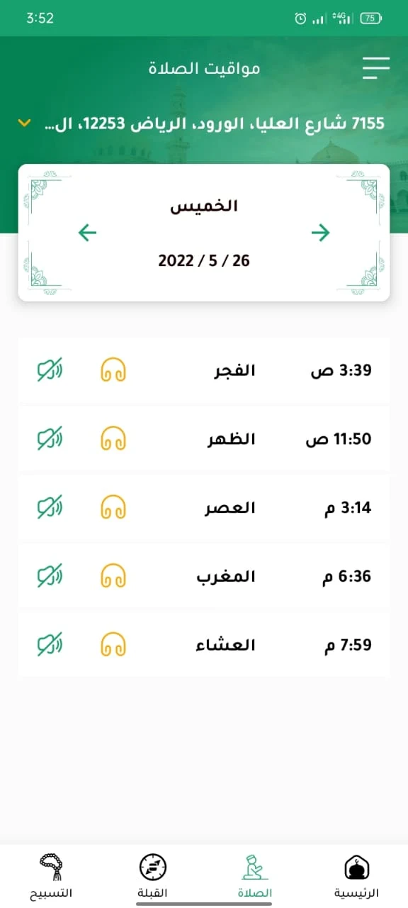
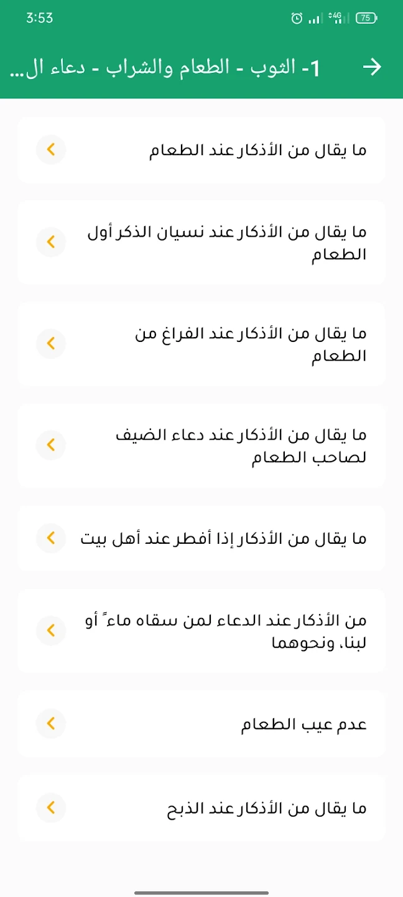
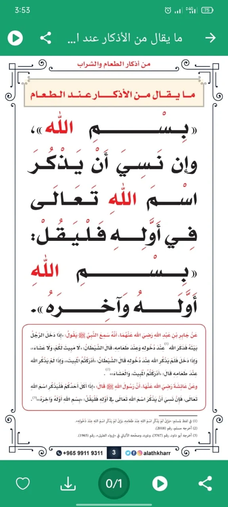
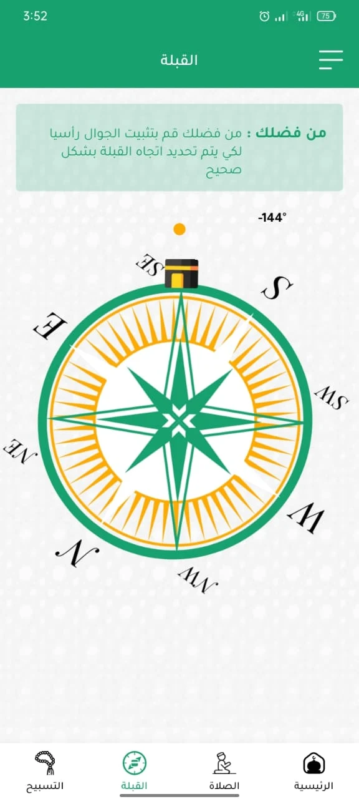
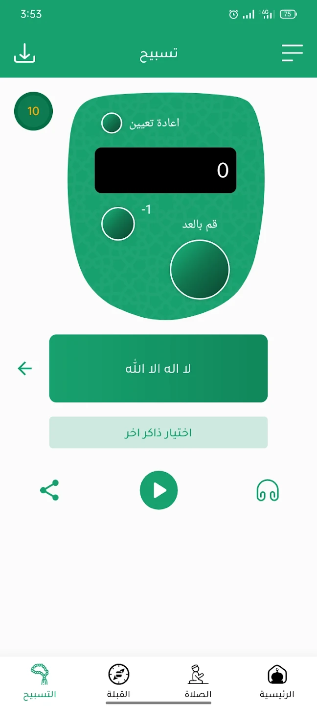
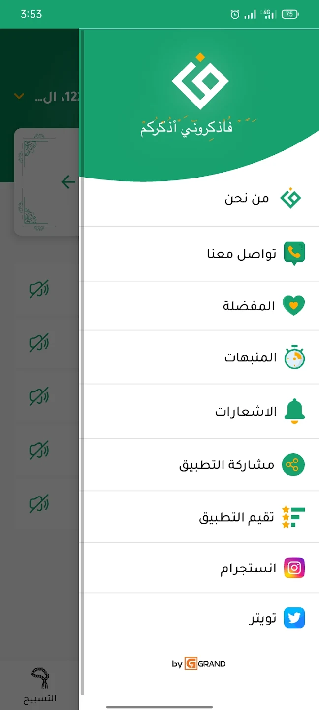

# About the Code

- Android app for Islam religion, shows times of pray, Qibla, Azkar & more.
- Pusher was used (Beams & Channels) to deliver notifications & real-time communications.

## Images from the App

 

 

 

